# Erstellung der Arbeitspakete (Emilio)

## AP 1: Frontend-Setup & Basis-Architektur

**Titel:** Projekt-Initialisierung & SPA-Routing

**Beschreibung:** Aufsetzen des Projekts mit Vanilla HTML, CSS und JavaScript. Implementierung des clientseitigen SPA-Routings via Browser History API. Entwicklung eines globalen Error-Handlers, der API-Fehler (401, 403, 500) abfängt und als non-invasive Toast-Notifications in der UI darstellt.

**Überprüfen:** Code-Review der Basis-Architektur auf Performance und SPA-Routing-Prinzipien; Testen des globalen Error-Handlers durch simulierte API-Fehler (401, 403, 500).

**Verantwortlich:** Emilio

**von - bis:** 27.03.26 - 27.03.26

**vorgänger - nachfolger:** Keine - AP 2, AP 3

---

## AP 2: Layout & Responsive Design

**Titel:** SPA-Gerüst, Navigation & Responsiveness

**Beschreibung:** Programmierung der grundlegenden Benutzeroberfläche inkl. persistenter Sidebar. Umsetzung des responsiven CSS-Designs (Desktop, Tablet, Smartphone) und Sicherstellung der Kompatibilität für Chrome, Firefox, Safari und Edge.

**Überprüfen:** Cross-Browser-Testing (Chrome, Firefox, Safari, Edge) und Prüfung der Responsiveness auf simulierten Desktop-, Tablet- und Smartphone-Geräten; Kontrolle der Sidebar-Navigation

**Verantwortlich:** Luca

**von - bis:** 24.04.2026 - 24.04.2026

**vorgänger - nachfolger:** AP 1 - AP 4, AP 5

---

## AP 3: Sicherheit (Frontend-Logik) & RBAC

**Titel:** Clientseitige Auth-Logik & Rollenbasiertes Rendering

**Beschreibung:** Anbindung von Login/Logout, Speicherung des JWT im Storage. Programmierung des 30-Minuten-Inaktivitäts-Timers (Löschen des Tokens & Redirect). Implementierung der clientseitigen Live-Validierung für Passwörter. Einbau der RBAC-Logik, um UI-Elemente (z.B. Lösch-Buttons, Admin-Menüs) basierend auf der JWT-Rolle bedingt zu rendern.

**Überprüfen:** End-to-End-Testing des Login-/Logout-Flows und der sicheren JWT-Speicherung; Verifizierung des 30-Minuten-Inaktivitäts-Timers und Prüfung des bedingten UI-Renderings (RBAC) anhand verschiedener Benutzerrollen

**Verantwortlich:** Luca

**von - bis:** 24.04.2026 - 24.04.2026

**vorgänger - nachfolger:** AP 1 - AP 6, AP 7

---

## AP 4: Globale Suche

**Titel:** Suchleiste & Debouncing-Logik

**Beschreibung:** Erstellung der globalen Suchleiste im UI. Implementierung der JavaScript-Debouncing-Logik (300 ms Cooldown nach letzter Eingabe), bevor der GET-Request an /api/search gesendet wird. Darstellung der Suchergebnisse.

**Überprüfen:** Überprüfung der Suchfunktion auf korrekte Darstellung der Ergebnisse; Messung der Debouncing-Logik in den Entwicklertools zur Sicherstellung der exakten 300-ms-Verzögerung bei der Eingabe.

**Verantwortlich:** Luca

**von - bis:** 08.05.2026 - 08.05.2026

**vorgänger - nachfolger:** AP 2 - Keine

---

## AP 5: Kundenverwaltung (UI & API-Anbindung)

**Titel:** Frontend-Modul: Kunden & Betroffenenrechte

**Beschreibung:** Bau der Kundenliste inkl. UI-Controls für die serverseitige Paginierung. Entwicklung des Formulars zur Neuanlage (Pflichtfelder sichtbar, optionale Felder per Klick erweiterbar zur Datenminimierung). Integration der Buttons für Datenexport (Trigger für Download) und Löschung (inkl. vorgeschaltetem modalen Bestätigungsfenster für Admins).

**Überprüfen:** Funktionstest der Paginierung und der clientseitigen Formularvalidierung bei der Kundenneuanlage; Kontrolle der Export-Downloads und des Lösch-Modals inklusive strikter Admin-Berechtigungsprüfung

**Verantwortlich:** Emilio

**von - bis:** 08.05.2026 - 08.05.2026

**vorgänger - nachfolger:** AP 2, AP 3 - Keine

---

## AP 6: Dokumenten-Management (Angebote & Rechnungen)

**Titel:** Frontend-Module: Angebote, Rechnungen & PDF-Preview

**Beschreibung:** Erstellung der Listen- und Detailansichten für Angebote und Rechnungen (inkl. Paginierungs-UI). Bau der Formulare für Anlage, Bearbeitung und Statusänderung. Integration eines in-Browser PDF-Viewers zur Vorschau der Dokumente (/api/offers/{id}/pdf und /api/invoices/{id}/pdf), bevor der tatsächliche Download getriggert wird.

**Überprüfen:** Überprüfung der Datenbindung in den Listen- und Detailansichten; Testen aller Statusänderungs-Workflows und funktionale Validierung der nativen in-Browser PDF-Vorschau für Angebote und Rechnungen

**Verantwortlich:** Emilio

**von - bis:** 22.05.2026 - 22.05.2026

**vorgänger - nachfolger:** AP 2, AP 3 - Keine

---

## AP 7: Admin-Bereich (UI & API-Anbindung)

**Titel:** Frontend-Modul: Benutzerverwaltung & Logs

**Beschreibung:** Entwicklung der UI-Ansichten für Administratoren. Tabelle zur Auflistung der Systembenutzer, Formulare zur Anlage neuer User, Rollenzuweisung und Passwort-Änderung. Ansicht zur tabellarischen Darstellung der DSGVO-Änderungsprotokolle (/api/logs).

**Überprüfen:** Review der UI-Komponenten für die Benutzerverwaltung auf Vollständigkeit der Anlage-, Bearbeitungs- und Passwort-Reset-Funktionen; Überprüfung der korrekten tabellarischen Darstellung der DSGVO-Logs

**Verantwortlich:** Luca / Tim

**von - bis:** 05.06.2026 - 05.06.2026

**vorgänger - nachfolger:** AP 3 - Keine

---

## AP 8

**Titel:** Finale UI-Prüfung & Anforderungsabgleich

**Beschreibung:** Manuelle Überprüfung der gesamten Benutzeroberfläche auf visuelle Korrektheit, Usability und strikte Einhaltung aller im Pflichtenheft definierten Vorgaben (z. B. Datenminimierung, DSGVO-Konformität, non-invasives Error-Handling). Fokus liegt auf der User Experience und dem funktionalen Abgleich, nicht auf dem Quellcode.

**Überprüfen:** Schritt-für-Schritt-Durchlauf aller Ansichten und Workflows im UI aus Nutzer- und Admin-Perspektive; tabellarische Gegenüberstellung der fertigen Frontend-Features mit den Akzeptanzkriterien des Pflichtenhefts zur finalen Freigabe.

**Verantwortlich:** Tim

**von - bis:** 05.06.2026 - 05.06.2026

**vorgänger - nachfolger:** AP 1 bis AP 7 - Keine

---

## Info

Im "Pflichtenheft" sind weitere Informationen zu finden

---

## Vorgehensweise

### Warum Iterativ/Agil?

Dadurch können viele Tests, Flexibilität und ggf. weitere Änderungen, die in der Entwicklung auffallen, sichergestellt und umgesetzt werden.

---

## Auf der Todo-Liste

Erstellung von GANT / Netzplan (Luca): Abgeschlossen

### GANT

### Netzplan

